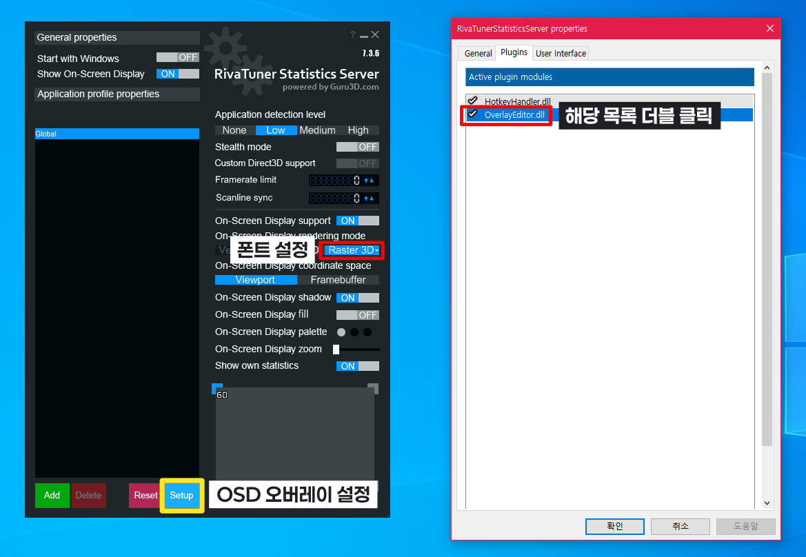
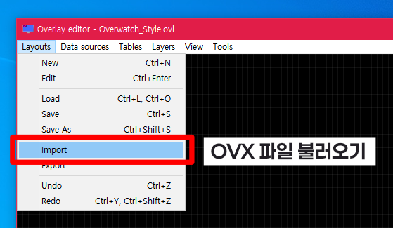

# Overwatch Theme for RivaTuner Statistics Server (RTSS)
Overwatch™의 FPS 오버레이와 유사한 테마를 구현한 템플릿입니다

## 설치 방법
### 1. RTSS 또는 Afterburner 설치
우선 RivaTuner Statistics Server를 설치하거나, MSI Afterburner를 설치해 줍니다.

> ℹ️ MSI Afterburner가 기능이 훨씬 더  많으나, RTSS 기준으로 설명하겠습니다

### 설치 링크
* RTSS: https://www.guru3d.com/download/rtss-rivatuner-statistics-server-download
* Afterburner: https://kr.msi.com/Landing/afterburner/graphics-cards

### 2. Saira 폰트 설치
현재 버전의 Overwatch™ UI와 가장 흡사한 `Saira-Regular.ttf` 폰트를 설치해 줍니다. 우측 상단의 **Get Font**를 누르고, **Download All** 버튼을 눌러줍니다
* Saira: https://fonts.google.com/specimen/Saira

### 3. RTSS 설정

1. **Raster 3D**를 선택해 글꼴을 선택합니다. 글꼴은 `Saira` 이며, 글꼴 크기는 자유롭게 설정합니다
2. OSD 파일을 불러오기 위해 아래에 있는 **Setup** 버튼을 클릭하고, **Plugins** 메뉴에 가서 `OverlayEditor.dll` 파일을 더블 클릭합니다

3. **Layouts** 메뉴를 선택하고 **Import** 메뉴를 선택해 줍니다. `Overwatch_Layout.ovx` 파일을 다운로드하고 불러와 주세요

### 4. 게임 실행
Overwatch™를 실행하고 작동이 되는지 확인합니다. 화면에서 설정한 OSD 화면이 나타난다면 성공입니다
